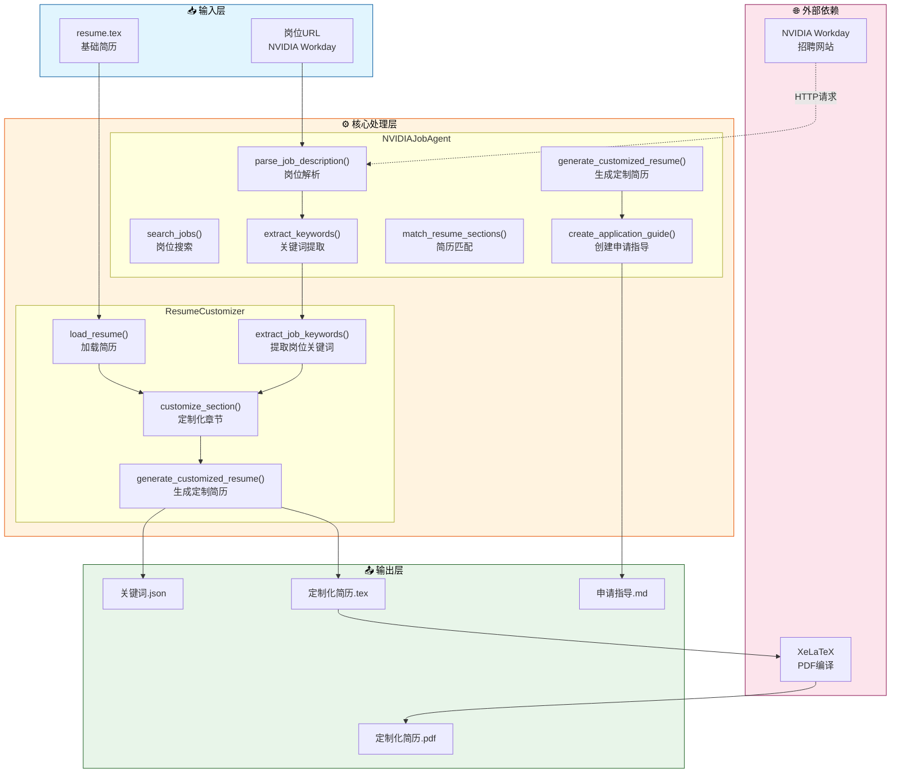
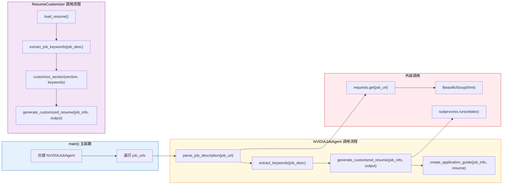
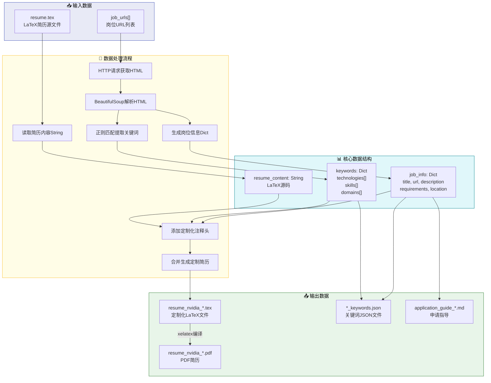
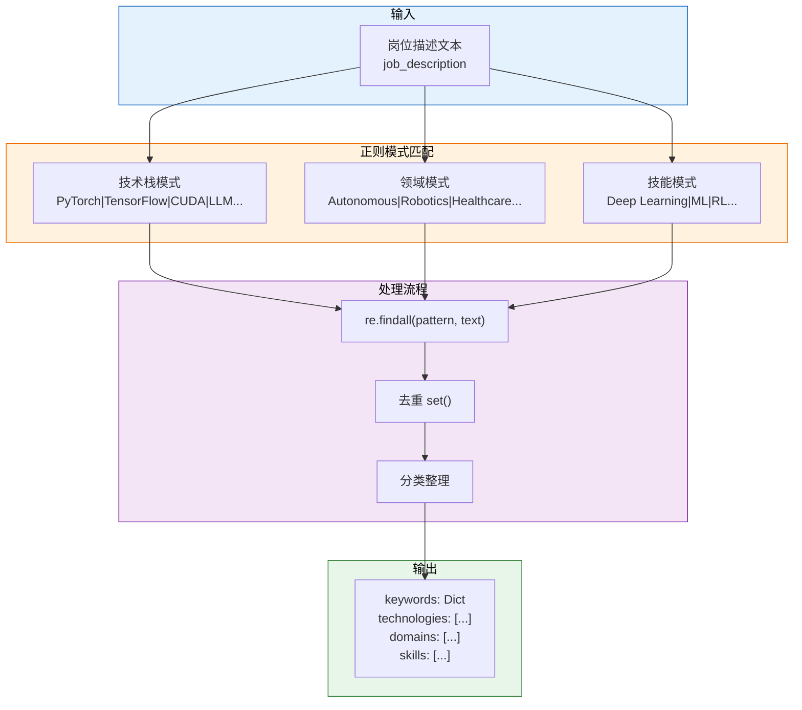
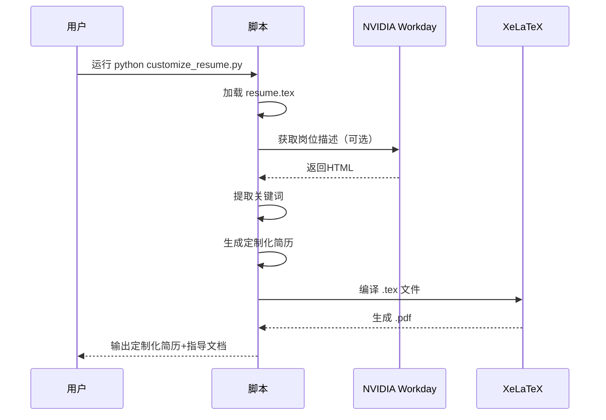

# 项目理解文档：NVIDIA岗位申请助手

## 📋 项目概述

这是一个**自动化简历定制工具**，帮助求职者针对NVIDIA的AI相关岗位生成定制化简历。

### 核心功能
1. **岗位搜索** - 搜索NVIDIA AI Agent相关岗位（上海）
2. **岗位解析** - 自动解析岗位描述和要求，提取关键词
3. **简历定制** - 根据岗位要求生成定制化简历
4. **申请指导** - 生成详细的申请步骤指导

---

## 🏗️ 架构图（Architecture Diagram）

展示主要模块、组件之间的关系和依赖。



**说明**：系统分为输入层（基础简历+岗位URL）、核心处理层（两个主要类）、输出层（定制化文件）和外部依赖（招聘网站+编译器）。

---

## 📞 API调用图（API Call Graph）

展示核心API函数之间的调用顺序和依赖路径。



**说明**：主函数创建Agent实例后，依次调用岗位解析→关键词提取→简历生成→指导文档的流程，外部调用包括HTTP请求和LaTeX编译。

---

## 🔄 数据流向图（Data Flow Diagram）

展示数据从输入、处理、存储到输出的流转路径。



**说明**：数据从URL和简历文件输入，经过解析、提取、合并处理，最终生成定制化的tex/pdf/json/md四种输出文件。

---

## 🧠 核心算法详解

### 关键词提取算法



**算法说明**：
1. 预定义技术栈、领域、技能三类正则模式
2. 对岗位描述进行多模式匹配
3. 去重并分类整理为字典结构
4. 用于后续简历定制化和匹配度评估

---

## 📁 文件结构

```
/workspace/
├── 📄 核心脚本
│   ├── job_application_agent.py    # 主Agent脚本（NVIDIAJobAgent类）
│   └── customize_resume.py          # 简历定制工具（ResumeCustomizer类）
│
├── 📝 简历文件
│   ├── resume.tex                   # 基础中文简历（LaTeX源码）
│   ├── resume.pdf                   # 基础简历PDF
│   ├── resume_en.tex                # 英文简历
│   └── resume_en.pdf                # 英文简历PDF
│
├── 🎯 定制化输出
│   ├── resume_nvidia_Senior_Software_Engineer_-_Multi-Agent_S.tex
│   ├── resume_nvidia_Senior_Software_Engineer_-_Multi-Agent_S.pdf
│   ├── resume_nvidia_Senior_Software_Engineer_-_Multi-Agent_S_keywords.json
│   ├── resume_nvidia_Developer_Technology_Engineer_-_AI.tex
│   ├── resume_nvidia_Developer_Technology_Engineer_-_AI.pdf
│   └── resume_nvidia_Developer_Technology_Engineer_-_AI_keywords.json
│
├── 📚 文档
│   ├── README_JOB_AGENT.md          # 项目说明文档
│   └── QUICK_START.md               # 快速开始指南
│
└── 🔧 配置
    └── requirements.txt             # Python依赖
```

---

## 👤 简历主人信息

### 张益新 (Yixin Zhang)

| 项目 | 信息 |
|------|------|
| **职位** | 算法工程师 |
| **邮箱** | zyxcambridge@gmail.com |
| **电话** | 17521398109 |
| **位置** | 上海 |
| **教育** | 北华航天工业学院 网络工程学士 (2010-2014) |

### 核心技术栈
- **深度学习框架**: PyTorch, TensorFlow, ONNX
- **GPU计算**: CUDA, TensorRT, TensorRT-LLM
- **部署平台**: NVIDIA Orin/Thor/Jetson, 地平线J5/J6, FPGA
- **AI Agent**: Multi-Agent系统, LLM, Transformer
- **自动驾驶**: BEV感知, 端到端部署, V2X

### 重要成就
1. 🏆 **NeurIPS 2025** CureBench国际智能体评测竞赛 **全球第二名**
2. 📄 论文发表: CureAgent (arXiv:2512.05576)
3. 📚 著作: 《自进化智能体–动态记忆与持续运行的架构实践》
4. 🎖️ Google机器学习开发专家 (连续5年)
5. 💰 商业成果: 量产MEC设备100+台, 创收500万+

---

## 🎯 当前目标岗位

### 1. Senior Software Engineer - Multi-Agent System - AV Infrastructure
- **匹配关键词**: Multi-Agent, AI Agent, PyTorch, CUDA, LLM, Distributed Systems, Autonomous Vehicle
- **定制简历**: `resume_nvidia_Senior_Software_Engineer_-_Multi-Agent_S.pdf`

### 2. Developer Technology Engineer - AI
- **匹配关键词**: Deep Learning, Machine Learning, GPU, CUDA, LLM, Transformer, Python
- **定制简历**: `resume_nvidia_Developer_Technology_Engineer_-_AI.pdf`

---

## 📊 技术依赖

```
requests>=2.31.0      # HTTP请求
beautifulsoup4>=4.12.0 # HTML解析
lxml>=4.9.0           # XML/HTML解析器
xelatex               # LaTeX编译器（系统级）
```

---

## 🚀 使用流程



---

**生成时间**: 2026-01-03

**文档版本**: v1.0
